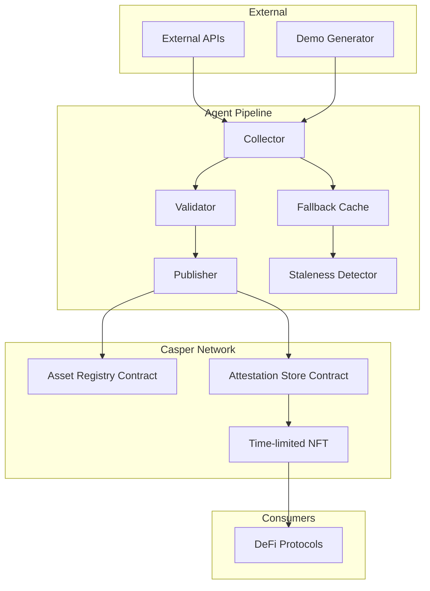
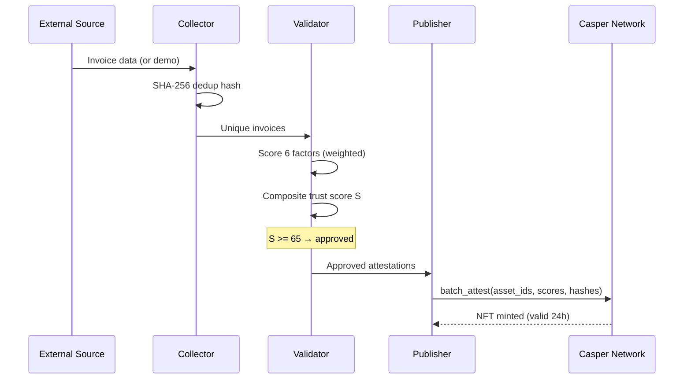
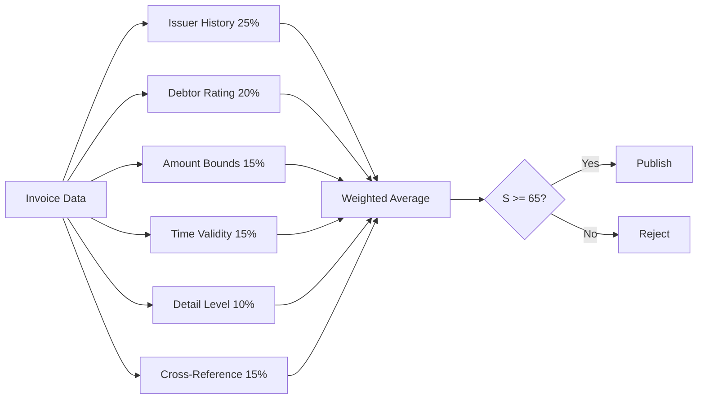
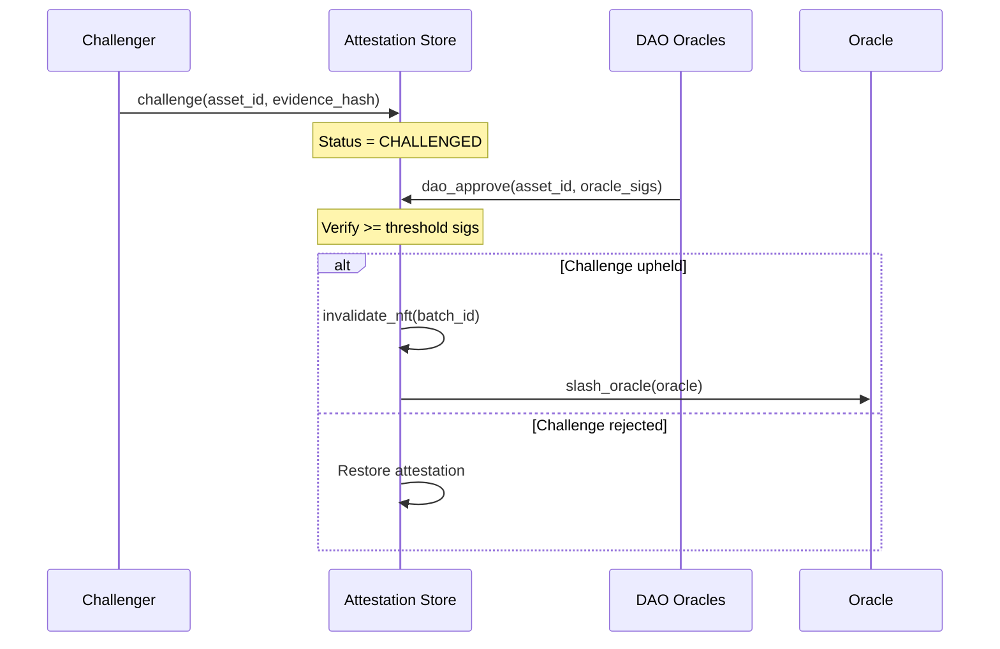

# Architecture

## System Overview

```mermaid
graph TB
    subgraph External
        API[External APIs]
        Demo[Demo Generator]
    end

    subgraph Agent Pipeline
        C[Collector] --> V[Validator]
        V --> P[Publisher]
        C --> FB[Fallback Cache]
        FB --> SD[Staleness Detector]
    end

    subgraph Casper Network
        AR[Asset Registry Contract]
        AS[Attestation Store Contract]
        AS --> NFT[Time-limited NFT]
    end

    subgraph Consumers
        DeFi[DeFi Protocols]
    end

    API --> C
    Demo --> C
    P --> AR
    P --> AS
    NFT --> DeFi
```

## Attestation Pipeline

```mermaid
sequenceDiagram
    participant Ext as External Source
    participant Col as Collector
    participant Val as Validator
    participant Pub as Publisher
    participant Net as Casper Network

    Ext->>Col: Invoice data (or demo)
    Col->>Col: SHA-256 dedup hash
    Col->>Val: Unique invoices

    Val->>Val: Score 6 factors (weighted)
    Val->>Val: Composite trust score S
    Note over Val: S >= 65 → approved

    Val->>Pub: Approved attestations
    Pub->>Net: batch_attest(asset_ids, scores, hashes)
    Net-->>Pub: NFT minted (valid 24h)
```

## Scoring Model

```mermaid
graph LR
    I[Invoice Data] --> F1[Issuer History 25%]
    I --> F2[Debtor Rating 20%]
    I --> F3[Amount Bounds 15%]
    I --> F4[Time Validity 15%]
    I --> F5[Detail Level 10%]
    I --> F6[Cross-Reference 15%]

    F1 --> WA[Weighted Average]
    F2 --> WA
    F3 --> WA
    F4 --> WA
    F5 --> WA
    F6 --> WA

    WA --> D{S >= 65?}
    D -->|Yes| Pub[Publish]
    D -->|No| Rej[Reject]
```

## DAO Governance Flow

```mermaid
sequenceDiagram
    participant Ch as Challenger
    participant AS as Attestation Store
    participant DAO as DAO Oracles
    participant O as Oracle

    Ch->>AS: challenge(asset_id, evidence_hash)
    Note over AS: Status = CHALLENGED

    DAO->>AS: dao_approve(asset_id, oracle_sigs)
    Note over AS: Verify >= threshold sigs

    alt Challenge upheld
        AS->>AS: invalidate_nft(batch_id)
        AS->>O: slash_oracle(oracle)
    else Challenge rejected
        AS->>AS: Restore attestation
    end
```
